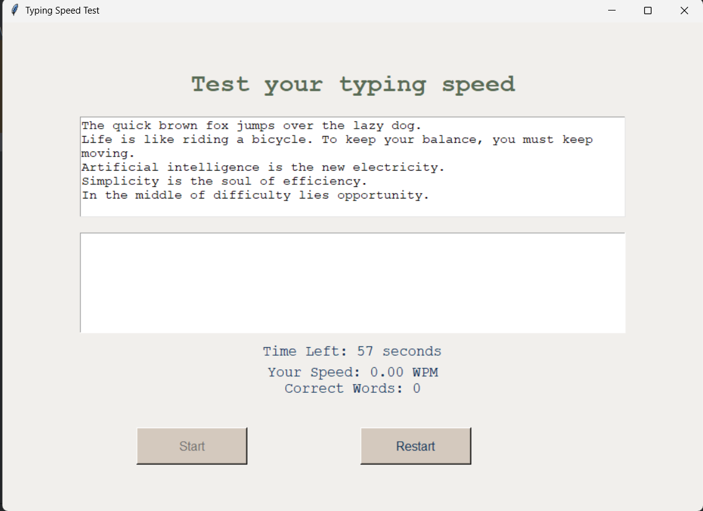
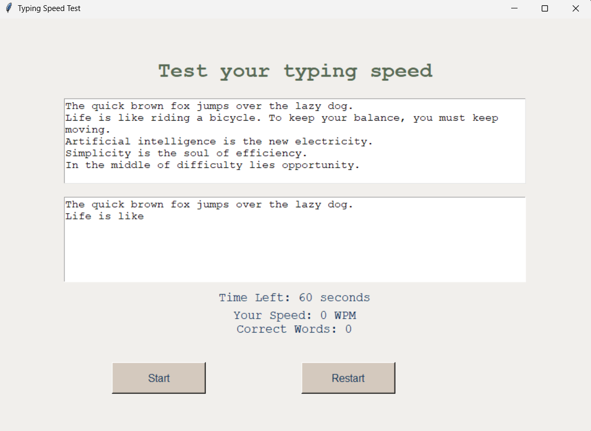
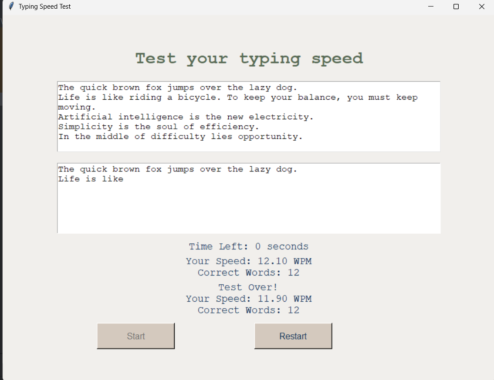

# ⌨️ Typing Speed Test GUI App

This is a Python-based desktop application built with Tkinter that allows users to test their typing speed. It measures typing speed in words per minute (WPM), tracks accuracy, and offers a simple interface for practice.

## Demo Preview

### Main GUI


### Restart Button


### Output Result


## 🚀 Features

- ✅ GUI built using Tkinter
- ✅ Random typing paragraph loaded from `file.txt`
- ✅ Real-time word-per-minute (WPM) calculation
- ✅ Countdown timer (60 seconds)
- ✅ Displays number of correct words
- ✅ Restart option to test again instantly

## 📁 Project Structure

````
typing-speed-test/
│
├── main.py             # Main application with full logic and GUI
├── test.py             # Alternate GUI version (simplified)
├── file.txt            # Text source for the typing test
├── README.md           # This documentation
├── .gitignore          # Files to exclude from version control
├── demo/                # Screenshots of GUI for documentation
│   ├── GUI.png          # Screenshot of the main GUI
│   ├── Restart.png      # Screenshot showing restart button
│   └── Result.png       # Screenshot showing the result
````

## 🧠 How It Works
#### When the "Start" button is clicked:

- A paragraph is loaded.

- The user begins typing in the text area.

- Timer starts for 60 seconds.

- The app calculates typing speed (WPM) and correct words in real time.

- After time runs out, results are shown, and input is disabled.


# 🖥️ Running the App


### On Windows:
````
python main.py
````
### On macOS/Linux:
````
python3 main.py
````


